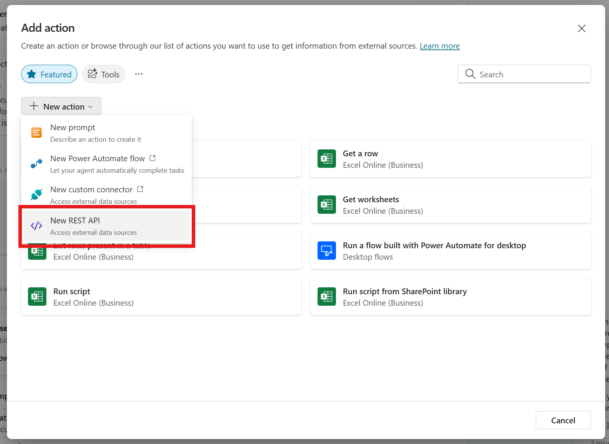
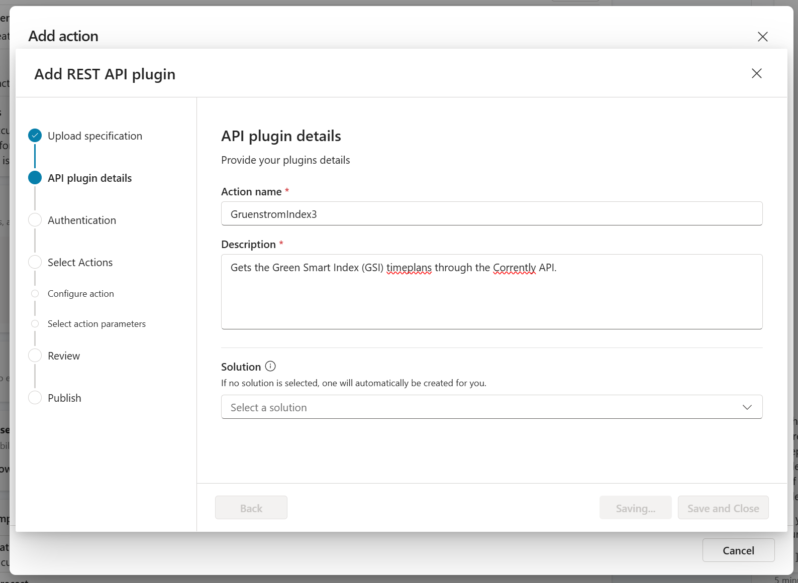
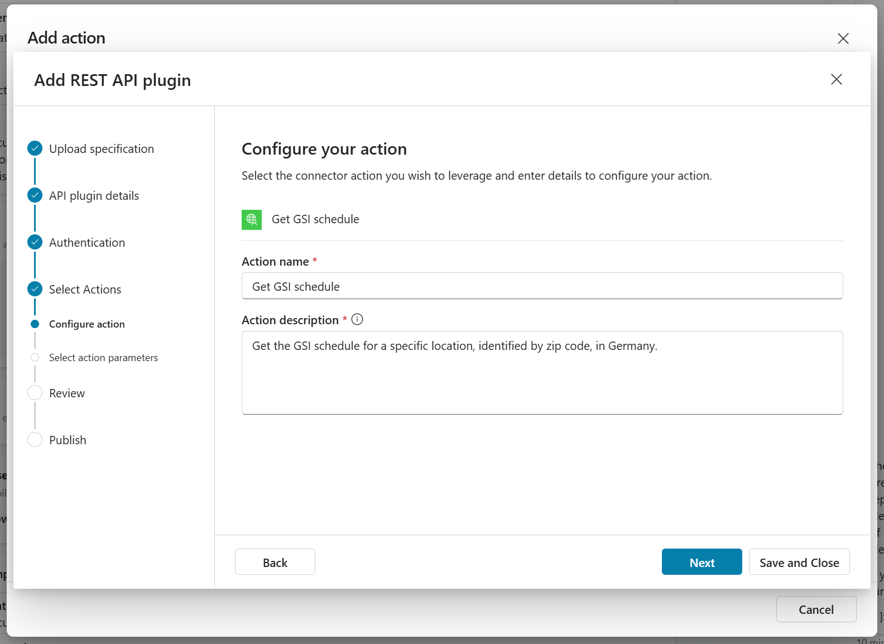
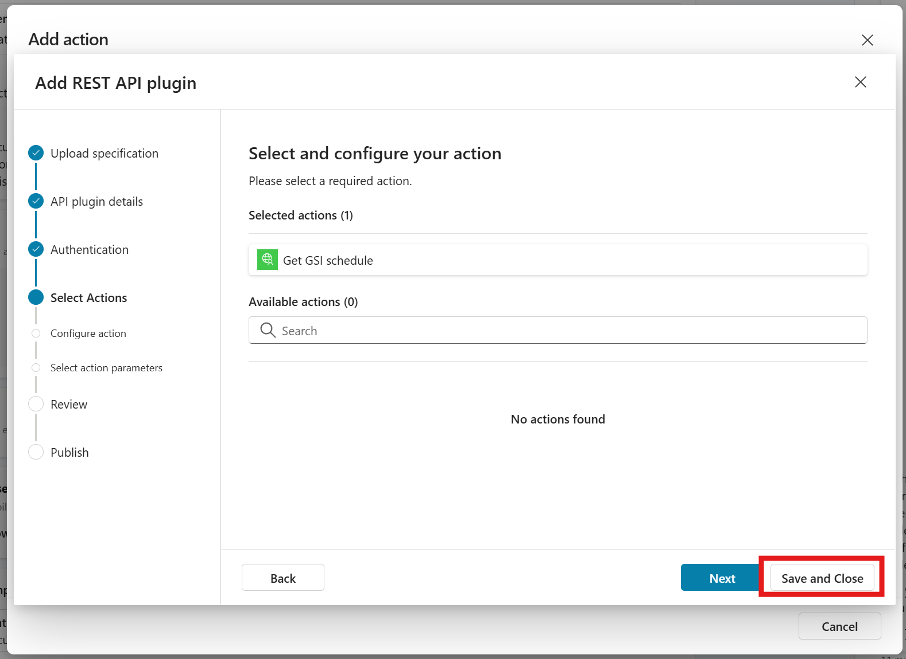

# Agent: Create advanced agent with custom API calls

This tutorial aims to implement an agent that demonstrates the use of custom API calls.

## Context

In this use case, the agent shall help to decide when to charge my EV to be do that as eco friendly as possible.
Wouldn't it be better to use electricity whenever a lot of green power from nearby generation is available? The Green Power Index (GrünstromIndex) indicates when there is a lot of renewable electricity in the grid that can be used in households. This way, everyone can support the energy transition in Germany and contribute to the efficient expansion of green electricity.
To help with this application, the user interacts with the agent to search for the best timeframe to charge their EV based on the GSI. The agent than automatically creates an outlook appointment to remind the user to start their charging.

## Agent overview

The agent shall include multi-step instructions to guide the user through the process. Have a look at the Microsoft learn article on how to write instructions: [Write effective instructions | Microsoft Learn](https://learn.microsoft.com/en-us/microsoft-365-copilot/extensibility/declarative-agent-instructions#step-by-step-instructions)

In general, the agent should, when prompted with the question to look for a charging schedule, start with the following steps: 1) Explain the user what the GSI is and why it's important, 2) When the user approves to schedule according to GSI, look up the GSI for the users current location, identified by their zip code (Hint: Most reliable when asked after the action was invoked and the action itself invokes the question for the zip code). 3) Present the user the results of the GSI timeframes, and select the timeframe with the highest GSI index, 4) Create an outlook appointment with that time frame as a reminder.

## How to add an API action

As a guidance, these steps are required to add an API action:

1. When having the declarative agent open, click on **+ Add action**
2. In the dropdown for **+ New action**, select **New REST API**:
\
\

3. In the new pop-up, click on the banner to upload an API description file, which is stored in this repository under [gruenstromindex_api.yml](gruenstromindex_api.yml).
4. After the file was parsed, enter a name for this API action to later find it again. **Please use an Action name including your user**, as multiple of these adapters will be created. You can leave the **Solution** empty.
\
\

5. When asked for the authentication, leave everything as **None**, as the GSI API doesn't require any authentication
6. As this API description only offers one endpoint, select the **Get GSI schedule** action. You can leave the default values as they are.
\
\

7. Next, you get an overview of all input and output parameters of the API. Review them to understand all fields. These manadatory descriptions are used to explain each and every field to the agent. As they are already prefilled from the API description, you can leave them and continue with the dialogue.
8. Afterwards, you'll be brought back to the **Select Actions** view. As the API only promotes one actions, you can finish the dialogue by pressing **Save and Close**:
\
\

